# SelfmanagementStore

This is an application to administate the flow of money of stores and supervisors using a WEB API REST using https and JWT token with user management and roles and permissions.

[WEB SERVICE APPI](https://github.com/aurquiel/WebApplicationTraceRegister)

[STORE APP](https://github.com/aurquiel/WinFormsAppTraceRegisterStore)

---

## Login

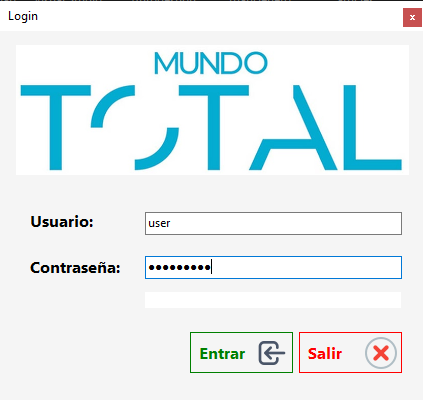

## Main

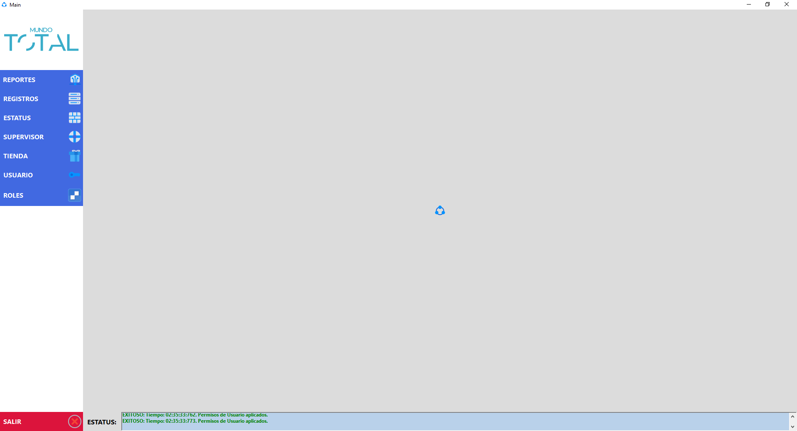

## Reports Store

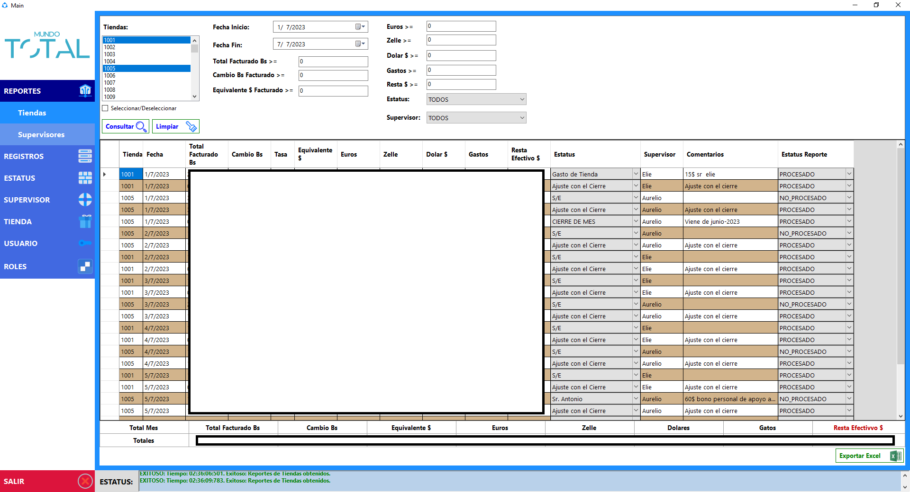

## Reports Supervisor

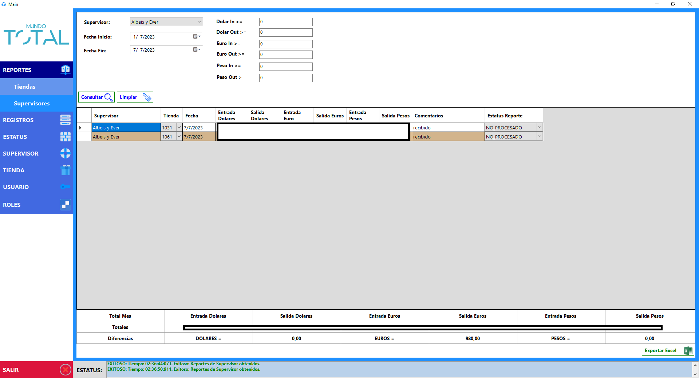

## Registers Store

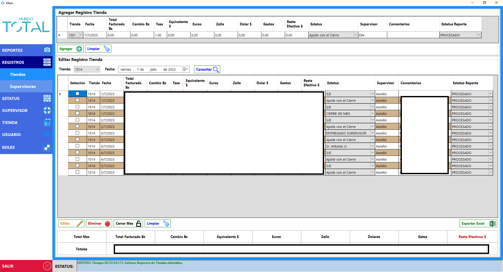

## Registers Supervisor

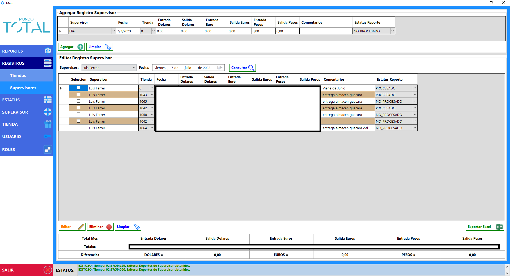

## Status

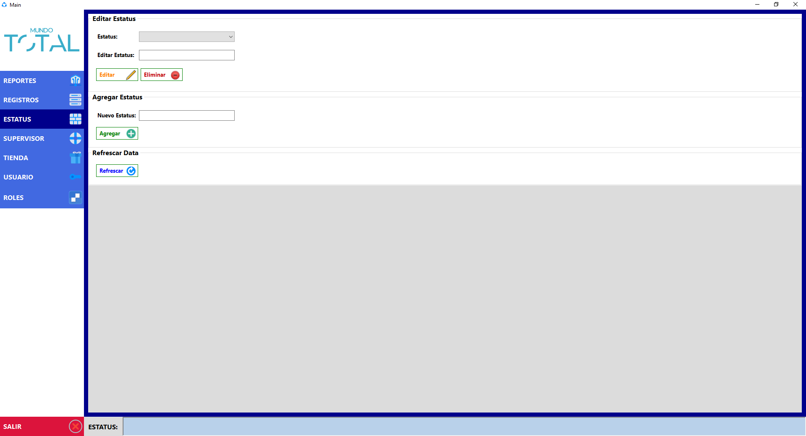

## Supervisor

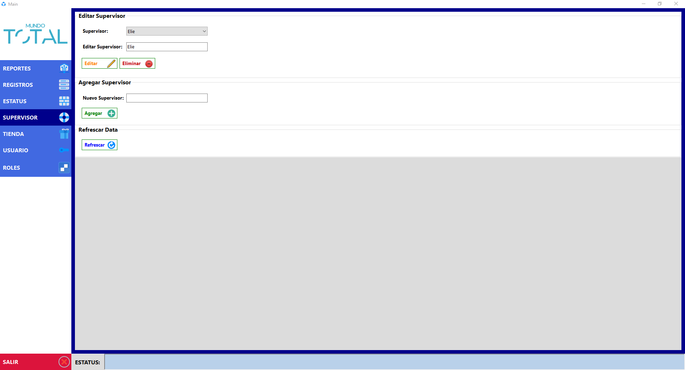

## Store

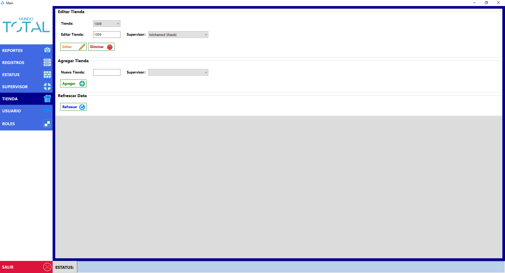

## Users

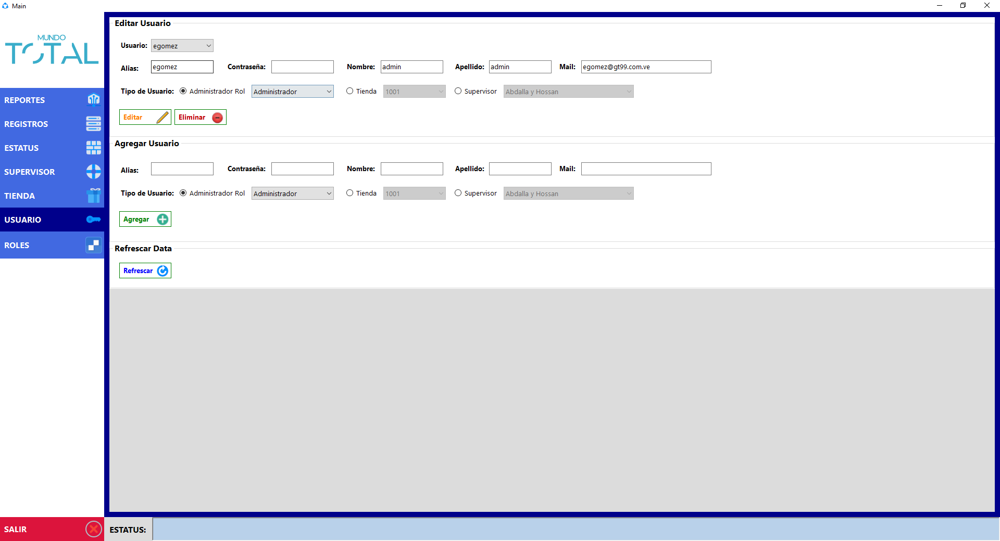

## Roles and Permissions

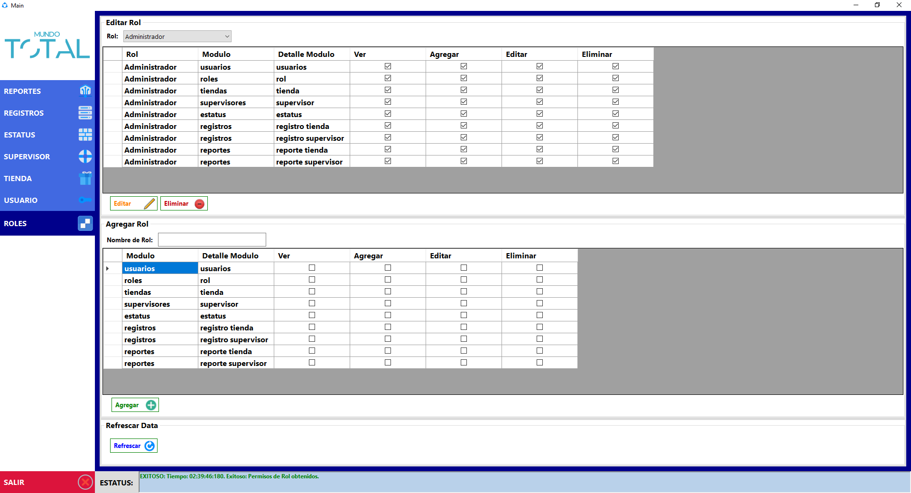
